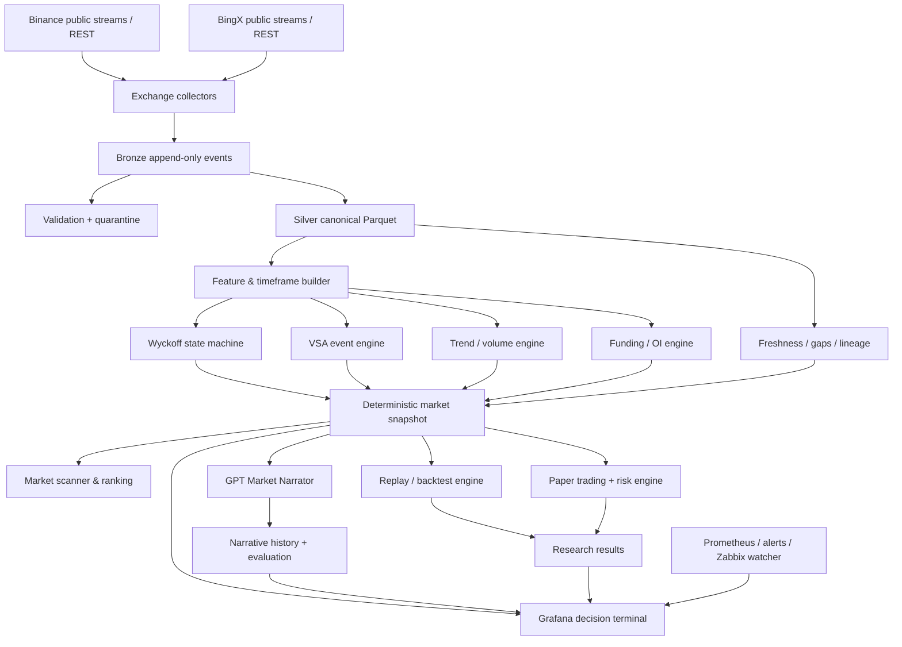

# AI Wyckoff Research Terminal — CTO Master Plan

## Product mission

Build a self-hosted, reproducible research platform that converts Binance and
BingX market data into quantified Wyckoff/VSA evidence, institutional market
commentary, and strictly isolated paper-trading results.

The platform is a research system first. Live execution is out of scope until
a separate governance decision after backtest, paper soak, and risk review.

## Non-negotiable principles

1. Market data and deterministic engines are the source of truth; GPT is not.
2. Every phase, event, signal, narrative, fill, and risk decision is replayable.
3. GPT has no exchange credential, order function, or path to an execution gate.
4. Rule confidence is not win probability. Calibrated probability must include
   sample size, test window, and model/rule version.
5. No look-ahead: a decision may use only data closed at its `asOf` timestamp.
6. Binance and BingX are independent observations, then a consensus source.
7. Storage is tiered: retain compact research truth; expire expensive raw detail.
8. Bamboo and NUC deploy immutable Git SHAs with environment-specific overlays.

## Target architecture

## Service boundaries

| Service | Responsibility | Writes | Forbidden |
|---|---|---|---|
| collectors | Public Binance/BingX ingestion | Bronze, quarantine | Credentials, trading |
| silver-processor | Validate, deduplicate, canonicalize | Silver, checkpoints | Mutating Bronze |
| silver-quality-exporter | Freshness, continuity, lineage | Metrics only | Backfill or repair |
| feature-builder | Closed-bar timeframes and bounded features | Feature snapshots | Trading decisions |
| wyckoff-vsa-research | Phase state machine and VSA evidence | Research journal/projection | Orders, credentials |
| market-scanner | Rank symbols requiring analysis | Scanner snapshots | Treat rank as order |
| market-narrator | Explain validated snapshots | Narrative journal | Change source facts or call exchange |
| replay-backtest | Event-time replay with fee/slippage/funding models | Backtest runs | Future information |
| paper-futures | Simulated execution behind risk engine | Paper journal/projection | Live order endpoints |
| system-trading | Read-only portfolio/admin UI | Audit/vault | Enabling live by narrator |
| monitoring | Metrics, alerts, dashboards | TSDB/dashboard state | Business-logic mutation |

## Data contracts

All contracts are versioned JSON/Parquet schemas and include:

- `schemaVersion`, deterministic ID, `asOf`, exchange, symbol, timeframe.
- source lineage and latest closed candle timestamp.
- data quality: freshness, internal gaps, trailing candles and completeness.
- engine/rule/config Git SHA.
- `liveTrading=false`, `executionActionable=false`, and
  `executionGatePassed=false` on all research and narrative artifacts.

The canonical market snapshot separates:

- `observations`: price, spread, volume, funding, OI and freshness.
- `ruleInferences`: phase, VSA events, trend state and rule scores.
- `scenario`: bias, confirmation, invalidation and missing evidence.
- `positionContext`: optional paper position and risk state.

GPT output must reference the snapshot ID and return structured JSON containing
market story, inferred operator activity, thesis, position commentary,
invalidation, evidence used, missing evidence, model, prompt hash and validator
result. Narrative text is never an input to the order/risk path.

## Storage and retention

| Dataset | Format | Suggested retention |
|---|---|---|
| Raw trades | compressed NDJSON/Parquet | 7–30 days initially |
| 1m canonical candles | Parquet | 12 months online |
| 5m/15m/1h/4h candles | Parquet | long term |
| Funding/OI/liquidation snapshots | Parquet | long term |
| Features and market snapshots | Parquet + metadata DB | long term |
| Signals, fills, risk and narratives | SQLite/PostgreSQL | long term |
| Prometheus detailed metrics | TSDB | 30–90 days |

Raw retention is changed only after replay tests prove that Silver plus lineage
can reproduce required research. Never delete data as part of deployment.

## Environments

- **Bamboo:** integration/staging, soak tests, operational monitoring.
- **NUC:** primary home research runtime after parity validation.
- **Developer laptop:** code, tests, dashboard provisioning; no permanent data.

GitHub is source of truth. Runtime configuration and secrets are not committed.
Deployments use exact SHAs; `main` receives only reviewed, soaked releases.

## Product views

1. Data Reliability Terminal.
2. Wyckoff + VSA Decision Terminal.
3. GPT Market Narrator card with evidence drill-down.
4. Paper Futures Trader and risk terminal.
5. Backtest and strategy-comparison report.
6. Morning Briefing and Weekly Research Notes.

## Governance gates

### Research-ready

- deterministic replay and IDs;
- quantified phase/VSA rules with unit tests;
- complete evidence lineage and stale-data rejection;
- no research-to-execution network path.

### Backtest-ready

- continuous canonical candles for selected windows;
- event-time replay with fees, slippage and funding;
- train/validation/out-of-sample and walk-forward separation;
- reproducible result from exact Git/config/data manifest.

### Paper-ready

- positive out-of-sample expectancy after costs;
- adequate samples by symbol, phase and event;
- risk limits tested with adverse scenarios;
- 30-day paper soak without safety violations.

### Live-review only

Live remains disabled. A future proposal requires a separate ADR, human approval,
restricted exchange key, tiny capital canary, independent kill switch and tested
rollback. GPT remains outside the execution path even then.

## CTO decision cadence

- Every 2 hours: automated operational exceptions only.
- Daily: data continuity, phase/event distribution and paper-risk summary.
- Weekly: backlog review, evidence sample sufficiency and storage growth.
- Per release: tests, exact SHA, rollback, security boundary and soak report.

The next highest-value task is documented in `docs/PRODUCT_BACKLOG.md` and must
be completed before adding more symbols or enabling GPT API calls.
